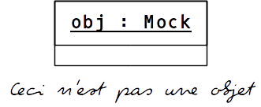

## *Trompeloeil*



CI: [ ](https://travis-ci.org/rollbear/trompeloeil)
[ ](
    https://ci.appveyor.com/project/rollbear/trompeloeil)
[](https://coveralls.io/github/rollbear/trompeloeil?branch=master)

[conan.io](https://conan.io) [  ](https://bintray.com/trompeloeil/trompeloeil/trompeloeil%3Arollbear/v30%3Astable/link)


> *trompe l'oeil* noun    (Concise Encyclopedia)  
> Style of representation in which a painted object is intended
> to deceive the viewer into believing it is the object itself...


What is it?
-----------

A thread-safe header-only mocking framework for C++11/14 using the Boost Software License 1.0

Documentation
-------------

- [Integrating with unit test frame works](docs/CookBook.md/#unit_test_frameworks)
- [Introduction](https://playfulprogramming.blogspot.com/2014/12/introducing-trompeloeil-c-mocking.html)
- [Presentation videos](#videos)
- [Trompeloeil on CppCast](http://cppcast.com/2017/02/bjorn-fahller/)
- [Cheat Sheet (2*A4)](docs/trompeloeil_cheat_sheet.pdf)
- [Cook Book](docs/CookBook.md)
- [FAQ](docs/FAQ.md)
- [Backward compatibility with earlier versions of C++](docs/Backward.md)
- [Platform and library support for Trompeloeil](docs/PlatformsAndLibraries.md)
- [Reference](docs/reference.md)

Also, follow up with the post on [sequencing](https://playfulprogramming.blogspot.se/2015/01/sequence-control-with-trompeloeil-c.html) for examples on how to restrict or relax allowed sequences of matching calls.  

If you want to contribute, read ACCU
[overload 125](https://accu.org/var/uploads/journals/Overload125.pdf)
to learn the internals.

Teaser
------
```Cpp
#include <trompeloeil.hpp>

class Interface
{
public:
  virtual ~Interface() = default;
  virtual bool foo(int, std::string& s) = 0;
  virtual bool bar(int) = 0;
  virtual bool bar(std::string) = 0;
};

void interface_func(Interface*); // function to test

class Mock : public Interface
{
public:
  MAKE_MOCK2(foo, bool(int, std::string&),override);
  MAKE_MOCK1(bar, bool(int),override);
  MAKE_MOCK1(bar, bool(std::string),override);
  MAKE_MOCK0(baz, void()); // not from Interface
};

TEST(exercise_interface_func)
{
  using trompeloeil::_;  // wild card for matching any value
  using trompeloeil::gt; // greater-than match

  Mock m;

  trompeloeil::sequence seq1, seq2;  // control order of matching calls

  int local_var = 0;

  REQUIRE_CALL(m, bar(ANY(int)))     // expect call to m.bar(int)
    .LR_SIDE_EFFECT(local_var = _1)  // set captured variable to value of param
    .RETURN(_1 > 0)                  // return value depending on param value
    .IN_SEQUENCE(seq1)               // must be first match for seq1
    .TIMES(AT_LEAST(1));             // can be called several times

  FORBID_CALL(m, bar(0));            // but m.bar(0) is not allowed

  REQUIRE_CALL(m, bar("word"))       // expect one call to m.bar(std::string)
    .RETURN(true)
    .IN_SEQUENCE(seq2);              // must be first match for seq2

  REQUIRE_CALL(m, foo(gt(2), _))     // expect call to foo(int,std::string&)
    .WITH(_2 == "")                  // with int > 2 and empty string
    .IN_SEQUENCE(seq1, seq2)         // last for both seq1 and seq2
    .SIDE_EFFECT(_2 = "cat")         // and set param string to "cat"
    .RETURN(true);

  interface_func(&m);

  // all the above expectations must be fulfilled here
}
```

Compiler compatibility
----------------------

Trompeloeil is known to work with:

* GCC [4.8.4](docs/Backward.md#gxx48x_limitations)+, 4.9.3+, 5, 6, 7, 8
* Clang 3.5, 3.6, 3.7, 3.8, 3.9, 4, 5, 6
* Visual Studio 2015, 2017

Latest patch level releases are assumed in the versions listed above.

Further details on C++11 support, platform and library limitations, may
be found in
- [Backward compatibility with earlier versions of C++](docs/Backward.md)
- [Platform and library support for Trompeloeil](docs/PlatformsAndLibraries.md)

<A name="videos"/> Videos
------

- Intro presentation from Stockholm C++ UG [(YouTube 34m)](https://www.youtube.com/watch?v=mPYNsARvTDk) [(Slides)](https://speakerdeck.com/rollbear/mocking-modern-c-plus-plus-with-trompeloeil)
- Presentation from NDC{Oslo} [(YouTube 52m)](https://www.youtube.com/watch?v=vvQ-kK4coYM&t=1122s) [(Slides)](https://speakerdeck.com/rollbear/ndc-oslo-using-trompeloeil-a-mocking-framework-for-modern-c-plus-plus)
- Detailed presentation from ACCU 2017 [(YouTube 1h25m)](https://www.youtube.com/watch?v=HCh6cs9nXt0) [(Slides with extra material)](https://speakerdeck.com/rollbear/using-trompeloeil-a-mocking-framework-for-modern-c-plus-plus)
